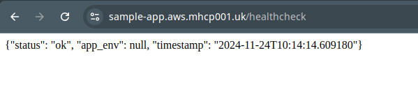
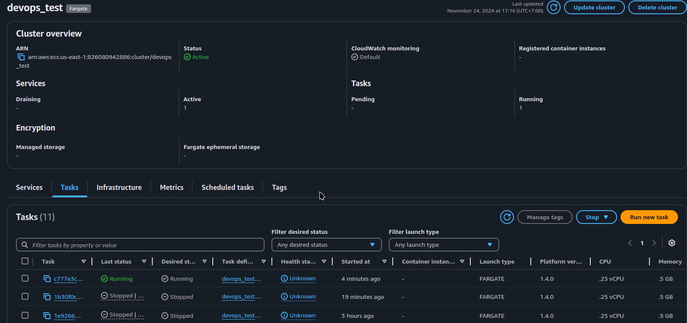
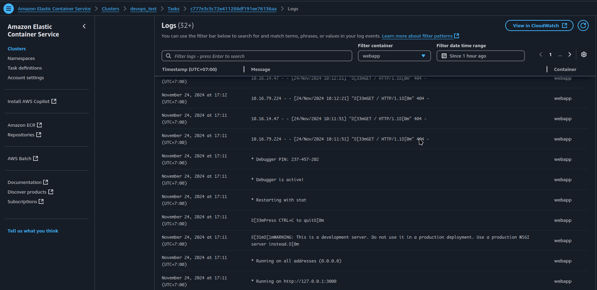
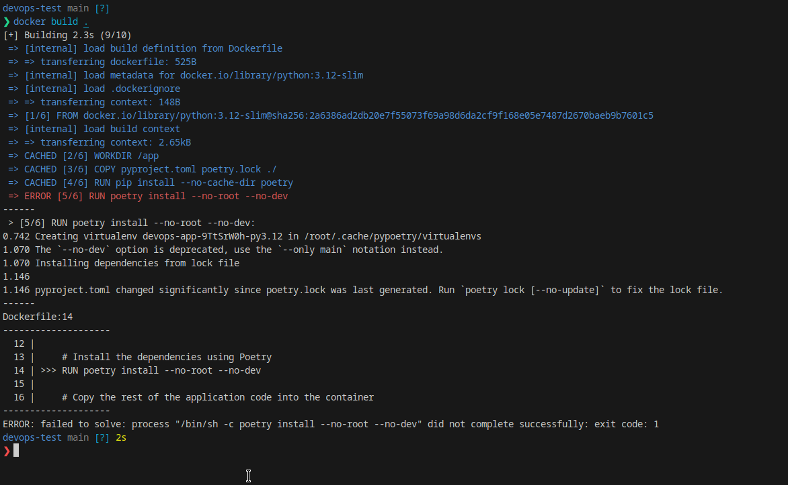
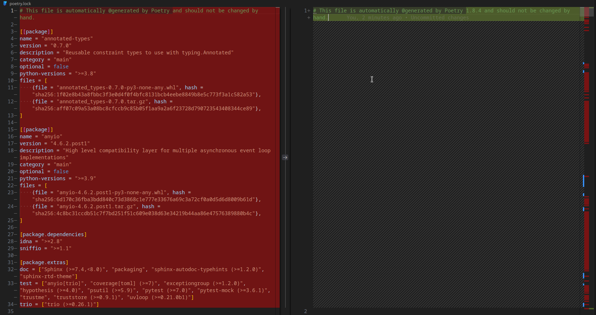
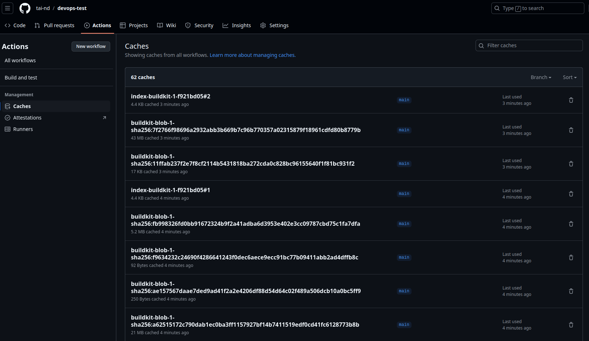
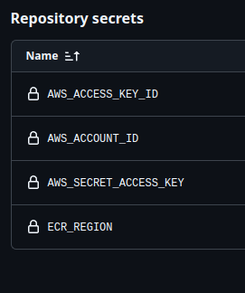

# Demo
Site: https://sample-app.aws.mhcp001.uk/healthcheck



ECS:



Task logs:



# Approach

1. First, I tried to run the scripts in Read me note in local => Failed.
Maybe there are something wrong with my local setup?

2. So I tried building image with docker build, still failed:
> docker build .



> pyproject.toml changed significantly since poetry.lock was last generated. Run `poetry lock [--no-update]` to fix the lock file.

Looklike there are some conflicts between `pyproject.toml` and `poetry.lock`.

Assumed that `poetry.lock` is broken, I flow poetry advice and override `poetry.lock`.

> poetry lock --no-update

The lock file change significantly:


This change should be commit & merge in a seprate MR but to keep it simple (for the test) I will keep all the changes in one MR.

=> Docker build worked.

3. Clear the requirements and make a plan

> Use an Infrastructure as Code (IaC) tool of your choice (e.g., Terraform, CDK,..) to define the deployment pipeline for the application.

=> I will use
- Terraform since it's popular and can be used in multiple platforms.
- Github Workflow since we are using Github for the test

> The pipeline should trigger automatically on code pushes to the main branch of the Github repository.

=> Github Workflow should handle this requirement easily

```yaml
name: CI/CD
on:
  push:
    branches:
      - main
  # Assumed that we also need to test code on pull request
  pull_request:
    branches:
      - main

jobs:
  build:
  test:

  deploy:
    runs-on: ubuntu-latest
    needs: [build, test]
    # only deploy for push in 'main' AND other jobs are success
    if: ${{ success() && github.ref == 'refs/heads/main' }}
```

4. Build and test
The code speaks itself so I think there is very litter to explain here.

I choose to run tests in docker because it bring us some benefits:
- Make test environment closer to prod environment & easier to reproduce in local
- Docker is present in Github Action runner - no need to install poetry, etc
- Take advantage of docker (linux namespace) isolation, ex: `--network=none`
- Speedup steps (ex: install poetry) by caching docker layers



In order to run test in docker we need to update Dockerfile by adding a new test stage that also install dev dependencies.

5. Deploy
We build and push new image to ecr with aws-cli. And update ecs task definition with new image tag (automated via github action & terraform)

Setup:
- VPC: 10.16.0.0/16, we need at least 2 subnets to setup ALB
  - us-east-1a:
      - subnet-web-a: 10.16.0.0/20
  - us-east-1b:
      - subnet-web-b: 10.16.64.0/20

>Deploy the application image to a container orchestration platform (ECS or EKS)

I used ECS since EKS is more expensive to start with, and use fargate to run containers (because it is easier to setup :v).

Src: [ecs.tf](../ecs.tf)

>Configure the deployment to use the existing ALB and SSL certificate

Src: [lb.tf](../lb.tf), [certificates.tf](../certificates.tf)

I didn't have any existing certificate, so I issued my self via ACM & Route53, but if we have an existing certificate, the process is similar (import the cert to terraform instead of create it, or just use cert arn).

Note: when changing port in aws_lb_target_group we need to recreate the target group but AWS will refuse to destroy the old target group cause there is an aws_alb_listener is depend on it. But terraform wasn't smart enough to do detect it, so we need to add a lifecycle policy for listener:

```
resource "aws_alb_listener" "devops_test_tls" {
  ...
  lifecycle {
    replace_triggered_by = [aws_lb_target_group.devops_test_web]
  }
}
```

And to make out website publicly accessible, we need to connect the ALB with internet (route traffic to internet gateway + allow ingress traffic via security group)

Src: [vpc.tf](../vpc.tf)

>A brief explanation (README file) of your approach and steps involved in deployment

Deployment steps:
- Create route53 hosted zone & add NS record to point nameserver of domain (or subdomain) to AWS route53 dns servers associated with the hosted zone [dns.tf](../dns.tf)
- Create s3 bucket to save terraform state [terraform.tf](../terrraform.tf)
- Configure secrets for github workflows 
- Trigger pipeline (ex: push to main)

# TODO
Next steps/improvements:
- Use a dedicated wsgi server to run flask: https://flask.palletsprojects.com/en/stable/deploying/
- Use separate security group for ALB & webapp
- Use a dedicated AWS IAM account with minimal permission for CI/CD or use role + delegate authentication to github OIDC (prefer)
- Make terraform plan work on approved PR
